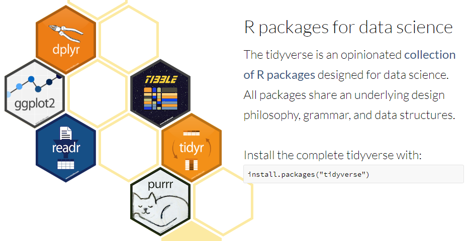
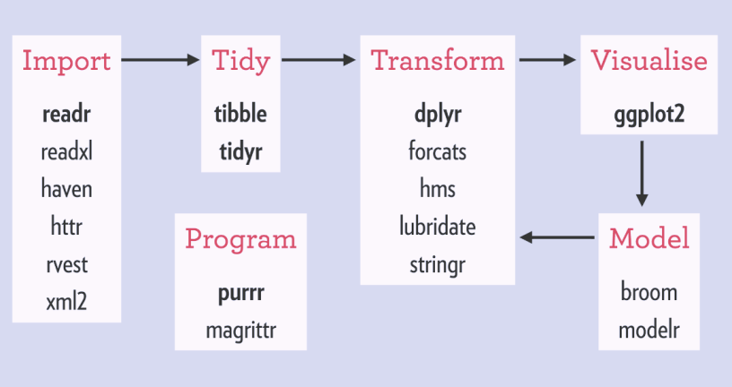
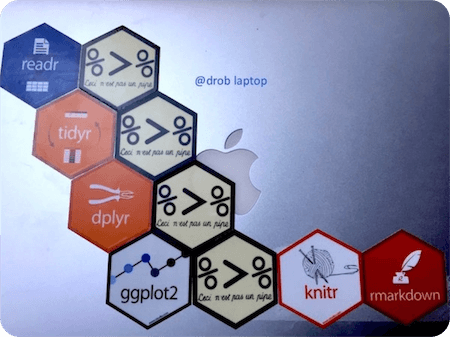
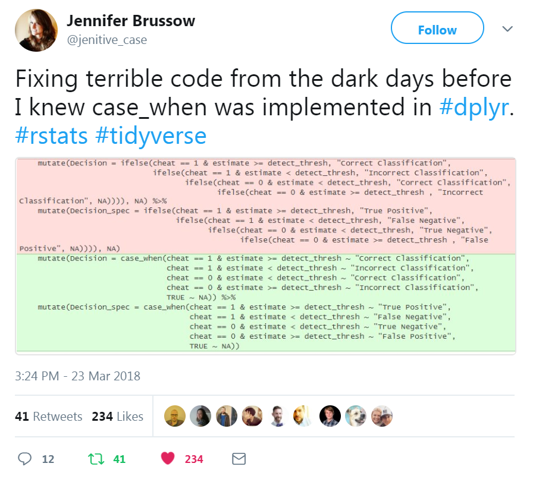
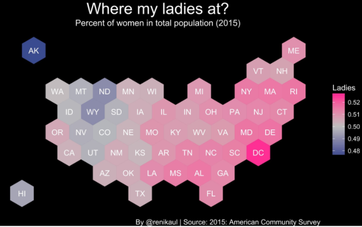
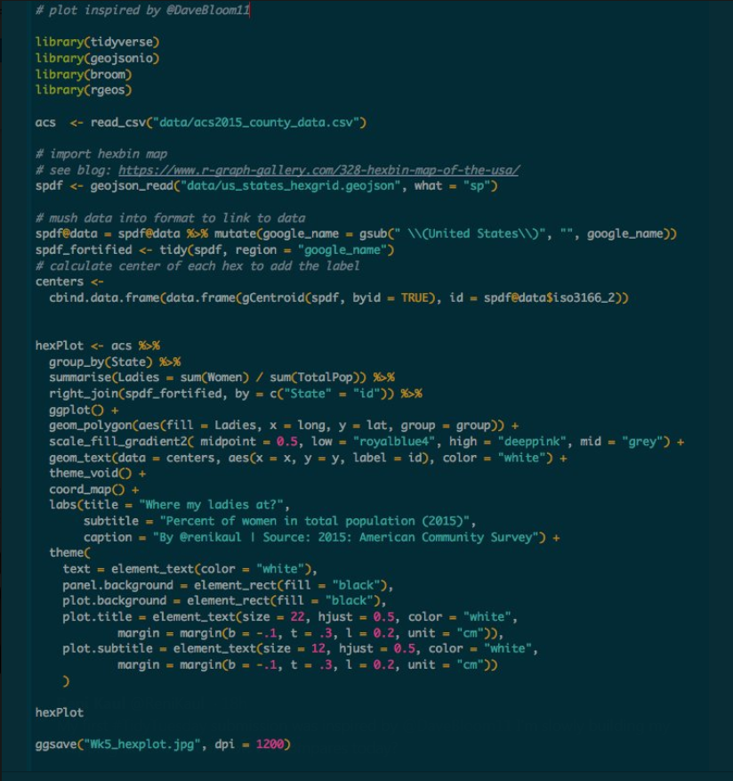
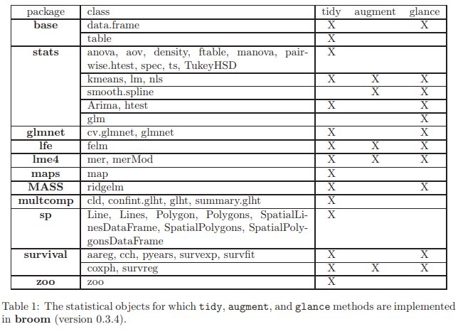

layout: true
.footer[Slides available at <span style="color:skyblue">https://bit.ly/2KNKALU </span>]

---

```{r setup, include = FALSE}
options(htmltools.dir.version = FALSE)

library(xaringanthemer)
mono_light(
  title_slide_background_color = '#073020D8',
  base_color = "#1c5253",
  header_font_google = google_font("Josefin Sans"),
  text_font_google   = google_font("Montserrat", "300", "300i"),
  code_font_google   = google_font("Droid Mono")
)
```

layout: true

---
# Where are my biases 

* Biomarker Statistician
* Genomic Data Scientist and Bioinformatician
* Visualization Engineer
* R/Shiny Developer
* Long time Linux/HPC/Vim user
--

* <span style="color:grey">SAS Certified Base and Advanced Programmer </span>

---
# Disclaimer

1. All the data and info in this talk are public (Twitter, GitHub). 
    - CDISC example data were downloaded from: [GitHub](https://github.com/phuse-org/phuse-scripts/tree/master/data)

2. This talk represents my own views, not those of BSSI. 
    - BSSI does not have an opinion of which tool you should use: e.g. SAS vs R, or R/base vs R/Tidyverse.

---

# Tidyverse

<center>
<a href="https://www.tidyverse.org/"> 

</a>
</center>

.footer[https://www.tidyverse.org/]

---

# Why? Why so popular (1/2)
- **Not** about the good-looking plots, or the fancy manipulation functions
- Content-driven and communication-focused workflow (logic-flow)
- Concisely expresses human logic as R code
    * Fast human logic I/O
    * Yourself `r emo::ji("left_right_arrow")` team / customer
    * Past you `r emo::ji("arrow_right")` present you
- Seamlessly align multiple layers of logic, across analysis objective, programming, and output
   
---

# Why? Why so popular (2/2)
- Structured domains of workflow, and well-defined verb/vocabulary within each domain
   * Grammar of data manipulation (dplyr)
   * Grammar of data visualization (ggplot2)
- consistent design:  
   * __learn it once, use it everywhere__

---

# How? Tidy principles

1. Tidy data <span style="color:grey">(Shared data structures)</span>
2. Tidy programming API <span style="color:grey">(Compose simple pieces)</span>
3. The pipe! `%>%` <span style="color:grey">(functional programming for human logic)</span>
4. Tidy statistics

<!-- This talk will demonstrate Tidyverse workflow through  -->
<!-- * on-line examples -->
<!-- * clinical and statistical programming examples -->


---
# Tidyverse: EDA (Exploratory Data Analysis) Workflow

Clinical programming is one of Data Science
<!-- * **data manipulation**, **exploration**  -->
<!-- * **visualization**, **reporting** -->

<center>
<a href="http://gph.is/1VD6OCF"> 

</a>
</center>

.footer[http://r4ds.had.co.nz/]

<!-- - Importing data  -->
<!-- - Tidying data  -->
<!-- - Transforming data -->
<!-- - Visualizing data -->
<!-- - Modeling data -->
<!-- - Efficient programming  -->

---

# A "Real" Tidyverse [Workflow](http://r4ds.had.co.nz/introduction-1.html)

<center>

</center>

<!--  -->

---

# What? Tidy data

* Each row is an observation
* Each column is a variable
* Clinical examples
  - **Long-format** is commonly used in data storage, e.g. SDTM/ADaM
  - **Wide-format** is commonly used for DEA, modeling, and visualization
  - Align manipulation, statistical and visualization logic with tidy data

---

# What? Grammar of data manipulation

* `dplyr`, key verbs
  -  `select` <span style="color:grey">(common verb in SQL)</span>
  -  `mutate` <span style="color:grey">(e.g. case_when)</span>
  -  `filter`
  -  `group_by` 
  -  `summarize`
  -  `arrange`
  
* Translatable to SQL 

* [Cheatsheet](https://github.com/rstudio/cheatsheets/raw/master/data-transformation.pdf)

---

# Example of Why, How&What


* Align your manipulation visually and logically
* Convert your raw coding to more consumable coding (shorten the logic gap)

---

# What? Tidyverse extended families

From the community
* [ggplot2 extention packages](http://www.ggplot2-exts.org/gallery/)
    - survminer, cowplot, ggpubr, etc
* [plotly](https://plotly-book.cpsievert.me/)
* [summarytools](https://github.com/dcomtois/summarytools)
* [janitor](https://github.com/sfirke/janitor)
* [tidyversity](https://github.com/mkearney/tidyversity)
* [jsmisc](https://github.com/strengejacke/sjmisc) 
* More bioconductor packages buy in!

---

# Clinical Programming Example 1/3

```{r include=TRUE, message=FALSE, warning=FALSE, cache=FALSE}
library(haven)
library(tidyverse) 
iris <- haven::read_sas('data/iris.sas7bdat')
adsl <- Hmisc::sasxport.get("data/adam/cdisc/adsl.xpt")

adsl %>%
    select(usubjid, contains('trt'), -starts_with('trt01a')) %>% 
    DT::datatable(options = list(pageLength = 3))
```

---
# Clinical Programming Example 2a/3

```{r include=TRUE, message=FALSE, warning=FALSE, cache=FALSE}
adsl %>%
    dplyr::group_by(trt01p) %>% # treatment-wise manipulation
    dplyr::summarize(ave_trtdur = mean(trtdur, na.rm = TRUE), 
		     n = n()) %>%
    knitr::kable(format = 'html')
```

---
# Clinical Programming Example 2b/3

```{r include=FALSE, message=FALSE, warning=FALSE, cache=FALSE}
adae <- Hmisc::sasxport.get("data/adam/cdisc/adae.xpt")
```

```{r include=TRUE, message=FALSE, warning=FALSE, cache=FALSE}
ae_max <- adae %>% 
group_by(usubjid) %>%     # group by patient: patient-wise manipulation
dplyr::arrange(aesev) %>% # sort AE severity from low to high, within patient
slice(n()) %>%            # take the most severe level, within patient
ungroup() %>%             
dplyr::select(usubjid, aesev) 

ae_max %>%
    DT::datatable(options = list(pageLength = 3))
```

---
# Clinical Programming Example 3/3
```{r include=TRUE, message=FALSE, warning=FALSE, cache=FALSE, fig.height = 4}
adsl %>%
left_join(ae_max) %>%
group_by(trt01p, aesev) %>%
dplyr::summarize(ave_trtdur = mean(trtdur, na.rm = TRUE), n = n()) %>%
ggpubr::ggbarplot(x = 'aesev', y='ave_trtdur', fill='trt01p', palette = "npg")
```

---
# Tidy programming API: Compose simple pieces

* Tidyverse vs Base R
  <!-- - `stringr` package, in replace of `*grep()` base functions -->
  <!-- - `purrr` package, in replace of `*apply` base functions -->
    - Reduce unnecessary intermediate objects (e.g. index, dummy variables), save your brain memory bandwidth
    - Data lives in structured data.frame, instead of, individual value or vector
    - Better default values, e.g. `stringsAsFactors=FALSE`, `drop=FALSE`


[R Inferno](https://www.burns-stat.com/pages/Tutor/R_inferno.pdf): An essential guide to the trouble spots and oddities of R
 

---
# The pipe! `%>%`

* Conceptually the same with Unix pipe syntax
  - Push the LHS output into the 1st argument of the RHS function

* Natural representation of human logic
  - Each processing layer is a function
  - Embrace functional programming

* Similar philosophy to `ggplot2`
  - Grammar of Graphics

---

# #TidyTuesday 1/3


---
# #TidyTuesday 2/3



---
# #TidyTuesday 3/3



---
# Tidy Statistics

### `library(broom)` turns tidy output of model objects that are suited to further analysis, manipulation, and visualization.



---
# Discussion

* R/Tidyverse is fast growing
    - Keep adopting new ideas
    - Some rare API change caused pain for R package developers (OK for general users)
* Environment/Namespace control is a common R problem
    - Loaded functions may be over-written by later loaded packages (or the packages' dependency packages...)
    - More robust usage is to add package namespace: `dplyr::select()`

---
# Thanks for attending
Special thanks to 
- [Statistical Inference: A Tidy Approach](http://bit.ly/ness-infer) [@old_man_chester](https://twitter.com/old_man_chester)
- [tidyverse 101: Simplifying life for useRs](https://paulvanderlaken.com/2017/07/07/tidyverse-101-simplifying-life-for-users/)
- Slides created via the R package [xaringan](https://github.com/yihui/xaringan) by Yihui Xie
- HTML document created via the R package [rmarkdown](http://rmarkdown.rstudio.com/) by RStudio
- Slides and source code are available at <https://github.com/freestatman/MBSW_2018_Tidyverse_Talk>

---

<center>

</center>

<!--  -->

---
layout: true
class: middle

